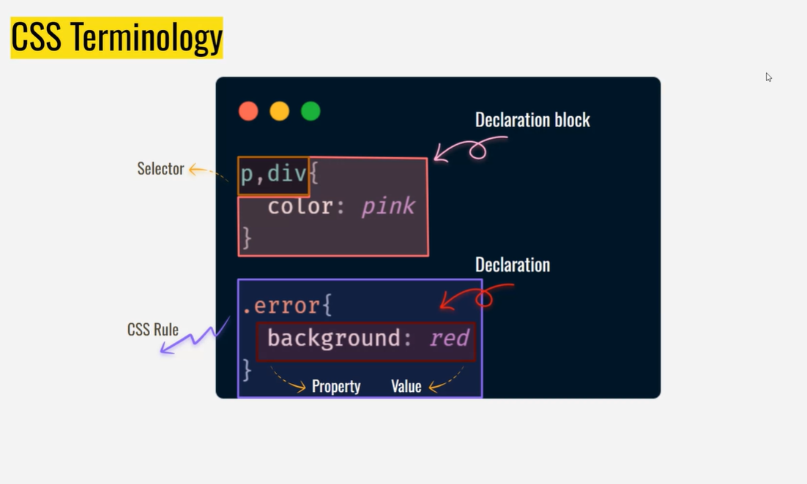
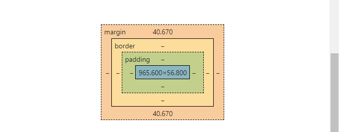

# html:
 emmet cheatsheet  

# anker tag:
 target attribute =_blank then the link will open in other page(tag) instead of same page.  

  we can give phone numbers(in anker tag give <b> ahref="tel:9000906504"</b>) and emails(href="mailto:paishwarya.com")  (open  default mail)
  # types of css:
  - internal
  - inline(no separation of concern)
   - external 
  # why internal css:
  for small, no need for http request
   time of rendering will be reduced.
   it is used for initial page.  
   concise is the key. 
    we shuld see that  minimal amout of lines there.    
   reuest and response will be problem in external css. 

# why external css:   
the same link can be used for different html pages(files).   

#  css terms:
   
# Text stylinG-I
# fo size:
it will increae the size of the text
# font-weight:
the thickness or boldness
# font style
italic,oblique(opp of italic)
# font family
times roman and all the other    
  

  diff betwwen serif and san serif:
serif fonts have those decorative lines or tapers (also commonly referred to as “tails” or “feet”)  
 while sans serif fonts don't—hence the “sanes” in their title. “Without tails, sans-serif fonts are made up of simple, clean lines that are the same width throughout.

# serif:
orthodox  
banks  
newspapers(they create there own fonts)  
100 yrs old gs in newspaper.
headings
serious
secured.

# sans serif:
we're not old,trendy then all modern.  
 we use , in the font family, that means if one font fails then other font can be used.  

 roboto font is used in android.

#  # Text stylinG-II
# text-transform:  
uppercase,lower

# text-align: 
for keeping words at center,left and right.

# text-decoration:  
for underlining and all.
 
 # letter spacing:
 wenever u want to do highclass, then increase line-spacing.   
 space betwwen the words. 

 # line-height:
 - space betwwen the lines.  
 - avoids re reading of lines  
 - inverse of ur font size.

# color formats:
 1. color name
2. Hex value(oldest way)(support in all the form of apps)
 3. RGBA(very rarely)
 4. HSL- HUMAN FRIENDLY
 5. Lcha--better color(better color  gammet.)  
combos:srgb,dcpi,adobe 
safari implemented this.  

# medium.com    

# box model:
every element in html sshuld follow box model.  

   

   # padding is complex property  
   it have left,right 
  
# border  

shrink inside then padding.
push the things --margin  
  
   we can bend the border