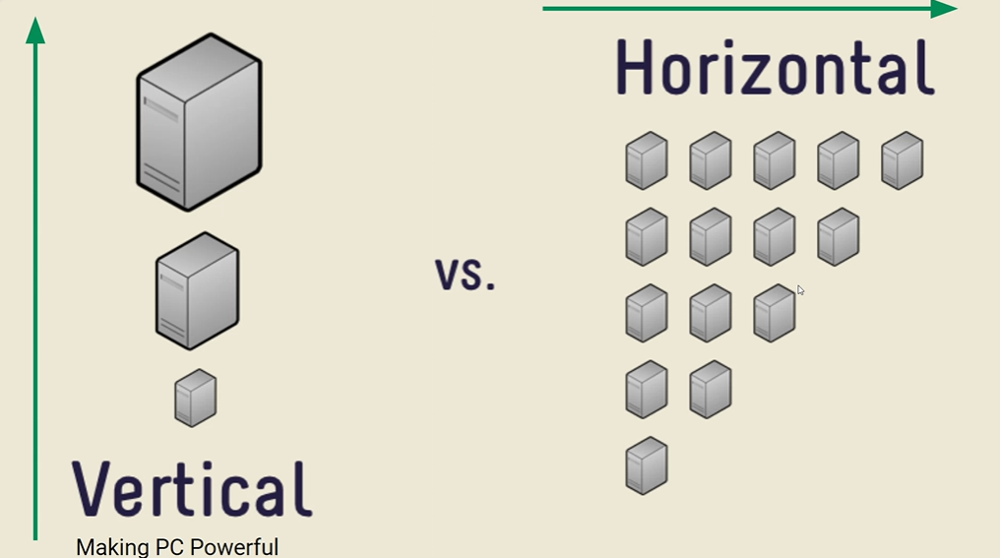

### intro the the web dvelopment

## browers wars

the war was betwwen netscape and IE

### 3 layer architechture

1. FE

- ANGULAR
- REACT JS

2.  BE

-
- DATABASE

```CSS
.red{


color:pink;

}
```

### selectors

caching is used whenever theres long time retrieve data  
cache depends


> logos are always in svg.  
>  svg(scalable vector graphics) :these have full clarity.

figma: to draw,design

### CICD

continous integration continous deployment

GIT:

### JS:

var t=null

> typeof(t)  
> 'object'

In web we dont fix problems/bugs
but we create new features.

## var declarations creating a variable

var---- can be changed.

let---- declarations cant be change

const------ cant be change

## var re-assigned 

var----can happen

let---- can be done

const----cannot be done

```javascript
const marks = [35, 45, 75];
marks[1] = 78;
console.log(marks);
```

but in case of array if one index is changed then it gets changed because of the address in which it is stored differently.
so hence we can change values inside at the particular address.

> pythontutor.com

 #                         DAY 2

 null datatype is object

### SCOPE:
LIFETIME OF VARIABLE:  
GC IS PRESENT
UNTIL IT IS USED IT WILL STAY IN MEMORY. 
AFTER THAT IT IS  NO LONGER PRESENT.
````javascript
   {
            var x1=10;//block scope
            let x2=20;//block scope
        }
this is the block scope.
````

Var can be declared and accessed globally. Let can be declared globally, but its access is limited to the block in which it is declared.  
 Variables declared using var can be re-declared and updated within the same scope. Variables declared with let can be updated but not re-declared within the same scope.


undefined---value
not defined----error
````javascript
 function fun(){
            var t1=10;
            let t2=20;
        }
        console.log(t1);
        console.log(t2);
````
the output for both is no defined.


## TypeCasting
var x1=3;  

var x2="5";  

console.log(x1+x2);//it is concatinating instead ofadd up. becuase it is overloaded.(priority to concate more than add)

console.log(x1-x2)// converts string to 5 thats why its 
 this is inbuilt implicit conversion or coercion.

  ## explicit conversion
  var x1=3;
  var x2="5";

  console.log(x1+parseInt(x2));  (doesnot allow decimal points )
  console.log( x1+ +x2);  
  these are the two methods.  
   
### conversions:
   if [2,4,5] +"abc"
    then it converts everything into string
    so output is '2,4,5abc'

[]+[] (its is empty string+empty string)  
so output is empty string. 
output is:  ' '
 
 ARRAY +STRING=STRING  
 ARRAY +ARRAY=STRING  
  

  null+5=  

output=5  

  null is 0 in this case.


4*"5a"
op:Nan  

NaN/3 
op:NaN  

typeof(NaN)(it is trying to converting into number thats why the type of nan is number).
 op:'number'


which is faster ?why?  

var g1=5;
var g2="5";  
console.log(g1==g2)
console.log(g1===g2)
== allows typecasting(string is converted into number and verification is done)  

=== doesnot allow type casting( only 1 step is done. )  

=== is faster than  ==

# TYPES OF FUNCTIONS
- Normal function  
- Arrow function  
- Anonymous Function  
## NORMAL FUNCTION
```javascript
function double(n){//n is the parameter
    return n*2;// what if there is no return?
    // then undefined is printed instead of the particular op. so return is imp
}//returning to function call
console.log(double(10));//10 is this argument 
//this is function call


//to ways to exit
//1.if it encounters a return
//2. or last of the body
   function double1(n){
    if(n>2){
        return 5;
    }
    console.log("Hi");
    console.log("Hi");
    console.log("Hi");
    console.log("Hi");

   };
   double1(9);
   double1(1);
```
## Arrow function

 const double3=(n)=>{
    return n*2;
   };
//adv:if it is one line, it can done into this way (no need of return to mention)
const double4=(n)=>n*2;
  
function sum(a,b){
    return a+b;

}
sum(9,8);

const sum2=(a,b)=>a+b;
sum2(6,7);
```

why functions?
DRY-TUMB RULE-DONT REPEAT YOURSELF. 
ABSTRACT A LOGIC INTO FUNCTION
chnage in one place it reflects everywhere. (it affects everywhere)  

modularity.
   ```

   whom we are writing code?  
   for other teammates
# how do u measure code quality?
5 pillars
1. Readability-75%
2.  Maintability(code debts----U'll make this code better 2mrw, but 2mrw never comes)(we shuld not have the code that is not maintainable)
3.  Extensibility(it shuld be easy to add features)
4. Testability
5. performance(space &time complexity)
readability>perfomance


## copy by value
var q1=[100,200];
var q3=[...q1];  
... ---> is the spread operator
then q3=[100,200]
 if it is  q1.push(100)
 then q1 is [100,200,100]
q3 is [100,200]
beacuse it is value not address to get changed.


var q1=[100,200];
var q3=[q1];  
//it is nested array output


## Loops
```javascript
const marks=[80,90,100];
//more control
for (let index=0;index<marks.length;index++){
    console.log("index:",index,"marks",marks[index]);
}

//readbale and simple
for(let idx in marks){//in-->index
    console.log("index:",idx,"marks:",marks[idx]);
}
//readable and cleaner
for(let mar of marks){
    console.log("mark:",mar);
} 
//here we dont have acces of index here so its better to use in than of
```


## DAY-4

ES6 FEATURES:
>LET&CONST
TEMPLATE LITERAL  
SPREAD OPERATOR
REST OPERATOR
DESTRUCTIONG
CLASS' ARROW FUNCTION==>
PROMISE
NUMERIC SPEARATORS 1_00_00_00

## OBJECT METHODS
 ```javascript
 let salaries={
    john:100,
    peter:300,
    Mary:300,
 };
 
 Object.keys(salaries);
 Object.values(salaries);

 ```
 # shortcuts
 ctrl+shift+p==>to open all the commands(command palette)  
 ctrl+space==>auto complete
  

  ctrl+clik=ck==.it is usfel for opening the things.


  ```javascript
 //Template literal
 //using backtick it makes code more readbale. just dollar and curly braces.
 //it also supports multiline string with help of backtick .
 const quotes=`Dream is not that u see in sleep, dream is something that does not let u sleep`

 const movieUrl = (domain, genre, year) => `http://${domain}?genere=${genre}&year=${year}`;
  //return "http://" + domain + "?genere=" + genre + "&year=" + year;
  


console.log(movieUrl("imdb.com", "thriller", 2020));
//refactoring u're not adding any feature,code will work in same way but quality better-->functionality same.
```


 >color faded but not used in parameters....to change it we shuld use interpolation(i.e add $,backtick)


 ## ARRAY DESTRUCTURING
const[t1,t2]=[100,200];  

//ARRAY DESTRUCTURING  

const[t1,t2]=[100,200];  

const[t1,t2,t3]=[100,50];  
//this gives an error undefined infor t3  
const[a1,a2,a3=80]=[100,200]  
/*when it is undefined it is taken as 80  
default value is taken only wen it is undefined  
const[]  
const[a1,a2,a3=80]=[100,200,500];  
here 500 is defined thats why a3 is taken as 500 instead of 80.*/

var [t1, t2] = [100, 200];  
  console.log(t1, t2);  
  //output  
  100 200  
 
  var [t1,t2,t3]=[100,200];  
   console.log(t1,t2,t3)  
  //output  
  100 200 undefined  
 
  var [t1,t2,t3=80]=[100,200];  
  console.log(t1,t2,t3)  
  //here t3=80 is called as default value  
  //output  
  100 200 80  
  ```
 
> The default value is only taken when t3 is undefined
 
```javascript

var [t1,t2,t3=80]=[100,200,500];
console.log(t1,t2,t3)
//output
100 200 500
 
var [t1,t2,t3=80]=[100,200,undefined];
console.log(t1,t2,t3)
//output
100 200 80
 
var [,t1,t2,t3=80]=[100,200,undefined];
console.log(t1,t2,t3) //output
200 undefined 80
```
 
> > This method is used to skip the values.This concept is called HOLES
 
```js
var [, , t1, t2, t3 = 80] = [100, 200, undefined];
console.log(t1, t2, t3); //undefined undefined 80
```
 
## Object destructuring
 
> The default value can be anything..number,object,etc..
 
- The object destructuring works on key-value based rather than the indexing.
 
```js
const {name,networth,power}={
  name:"Tony"
  house:🤠
  networth:🤑🤑🤑
  power:🦾
 
};
console.log(name);
console.log(networth);
console.log(power);
//output
 
Tony
🤑🤑🤑
🦾
```
 
> > The unpacking in array is done by indexing and the unpacking in Objects is done by Key considerations.  

 ```js
const avengers={name:"Tony",   house:"🤠"
const avengers={
  name:"Tony",
  house:"🤠",
  networth:"🤑🤑🤑",
  power:"🦾",
 
};
console.log(name);
console.log(networth);
console.log(power);
 
const {name,networth,power}= avengers
 
this is by using object destructing
...................................
has context menu
The unpacking in array is done by indexing and the unpacking in Objects is done by Key considerations.
 
## The task1 code with refactoring by using object destruction  

 

const cart = [
  { name: "apple", price: 0.5, quantity: 4 },
  { name: "banana", price: 0.25, quantity: 6 },
];
 
const newItems = [
  { name: "Cherry", price: 0.75, quantity: 5 },
  { name: "Date", price: 1, quantity: 3 },
];
 
//   Ex 1.1: Combine cart + newItems
const comb = [...cart, ...newItems];
 
var result = 0;
for (let { price, quantity } of comb) {
  result = r price * quantity;
}
console.log("The Total Price of all fruits : " + result);
//output
10.25;
```
 
## ES features
 
> > Unary operator : ++,--,!
> > binary operator : 2+5, 6-2, 9\*7 7/2
 
# Code snippets
 
# Truthy vs falsy
 
```js
let x = [];
if (x) {
  console.log("Hey");
} else {
  console.log("NOpe");
}
//output
Hey;
```
 
```js
let x = [null];
if (x) {
  console.log("Hey");
} else {
  console.log("NOpe");
}
//output
Hey;
```
 
```js
let x = null;
if (x) {
  console.log("Hey");
} else {
  console.log("NOpe");
}
//output
Nope;
```

## ES6
 
let and const
template literal
spread operator
rest operator
destructing
class
arrow function
 
## shortcuts
 
- ctrl + space -> autocomplete
- ctrl + / -> comment
- win + . -> emojis
- ctrl + , -> settings
- ctrl + shift + p -> command pallete
 
## Ternary condition
 
5>4 ?"awesome:"cool"
 
## Binary operators
 
arithematic +, - , / , \*
logical - && and operator || or operator
relational >,<,>=,<=,==,===
 
# unary operator
 
++ post increment
-- pre increment
! not
 
# Truthy vs falsy
 
```js
let x = "cool";
if (x) {
  console.log("hey");
} else {
  console.log("nope");
}
```
 
- if the value is converted true then its truthy(refer above ex)
- if the value is converted false then its falsy(refer below ex)
 
```js
let x = null;
if (x) {
  console.log("hey");
} else {
  console.log("nope");
}
o/p-nope

 
let x=[];
if(x){
console.log("hey");
} else {
console.log("nope");
}
o/p-hey
 
 
var height=150;
var final=140||height;
console.log(final);


var avgtemp=20
var temp=0||avgtemp;
console.log(temp);

//20(falsy values are followed here)
var avgtemp=20;
var temp=0??avgtemp;
console.log(temp);
//0(for null and undefined  falsy table is followed)
//... is also used as rest operator-

```
## string methods
>split
>join
>tolowercase
>touppercase
>reverse
>slice
>push
 PASCAL CASE--->CarEngine
 Camel case--->


 ## the software development life cycle.(SDLC)

 creating one design and other design--prototyping  
  figma->is the design tool
  auto layout
  coolors.co for colors used for designing.
  for any app we develop  
  >planning  
  >analysis  
  >designing we do it figma....
  >implementation----is developers  
  testing and integration--pushing to the customers  
  maintenance---every product will have support team to fix if anything is wrong.(very small small features are addded.)  

  ## stakeholders.
  
  they are the people who are responsible if anything goes wrong. they having the authority to change in the project.  
  People who are taking the risk. 
  responsible for make of the product.  
    
## project manager:mainly on the business side. he will know accounting.   
watch party:two people can watch the same show at a time ,it is paused it is paused for everyone.  

##  system architect
they will set up the project inititally.(to see which lang they shuld use.)what shuld be our FE,BE ABD db.  
It is the blue print of the project.   
ALL how they shuld be interact with each other.  
why we shuld shuld in our company.   
tailor making to the app 
They shuld have knowledge about everything.
They shuld also know about the cloud. 
 ## analysis:
P.O  
P.M  
business analyst  
Cto  
## design 
system architect  
ux/ui designer
## development  
front-end
back-end  
## testing  
solutions architect  
qa engineer  
tester  
devops
## deployment
>data adminstrator  
devops
## maintainance
>users  
>testers  
>support manager

.png>)
## structure of 6 phases


CEO+PM----->designer+PM  --------->ceo+pm+designer    --------->cto+pm-------->be+fe,cto,testing------>bet+fe(integration)tests-------->testing------>be+fe----->devops----->customers------>tickets raised(support team)----->again fe+be team will work on it.---->again testing,devops continuation until customer is satisfied.


designer+PM  --------->ceo+pm+designer is business analysis    
cto+pm is technical analysis.  
be+fe,cto,testing------>bet+fe(integration) is implementation 


### service and product based 
>product based---->lots of investement in r&d  (multiple customers) replicated easily .   
>lots of  time  
>example:netflix  (its not a one time thing.)  
>service based: its a one time thing,it is customised for a particular need only.     
>its for particular customer.  
they keep on changing languages.

## methodologies:
## waterfall model
6 months time
reqiurement  is clear
planning is done u cant shift columns after wrds,things cannot be changed  
eg:construction of bridge...is permanent we cant change it again if we want.  
for suppose: u want to change from react to angular,without changing any requirement only structure is changed (technology migration in IT) 
customer interaction is not there,,,,what is last output is  .
2 release


## agile 
- everytime the cycle is keep on repeating regularly.   
- monthly release is there to check waht is wrong.   
- quickly make mistaken, learn from it and implememt again.  
- deployements 3 times in day.
2sprints in a month
( 1 sprint is 2 weeks)  
( 2 weeks for development   
2 weeks for testing)
 ## implementing agile:
 -scrum is the implementation of agile.   
  - why agile:interaction with the customer

  ## implementation of agile:
  ## SCRUM
!
tickets are for to see what people are dng what task.
sprint planning(1hr time)(task is split into small chunks)----->  
!  

sprint planning---1hr 
scrum master --assign the tasks.
<b>Story Points</b>-The time duration assigned to complete a particular task in the scrum

the task which is assigned---story point.(fibannoci)(estimated days to complete the task)(ask seniors)( 1 2 3 5 8)days
standup---(10-15min)  
block-there are stuck in between without doing the task.  
sprint retrospective----what can be improved can be said.(1 hr)   

. 

## HOW TO RUN THE 

- ONES CODE IS CHECKED BY ANOTHER VICE VERSA----PEER REVIEW (code quality is checked)(if they are following any coding standards)
- WORK WHICH IS NOT DONE---BACKLOG(T0-DO)
- WHICH IS RUNNING RIGHTNOW---(IN PROGRESS) 
 

 <b>kanban board</b>: its a tool for managing the scrum.

# BURNDOWN CHART:
Describes the task flow at which time 

- It is regarding the progress.
- this shows the continuous work  

!

<b>spill-over</b>:sharing the work left in one sprint to another sprint.  

!


## coding standards:

Are meant have uniformity throughout ur code base  
## code Quality
## Dry  
## variables name
- understandable/descriptive
```js
let a=50;//❌
let age=50;//✅
```
- camelCase
```js
let student_name="aishwarya";❌
let studentName="aishwarya";✅
```

- choose 'let' over 'var','const' over 'let'
```js
let panCard="B153729EHDIH";❌
const panCard="B153729EHDIH";✅

```
```js
const PI_VALUE="3.14";✅
const pi_Value="3.14";❌
```

 ### errors(for variable name)
 - reserved keywords('if','for')
 ```js
 let if="aishwarya";❌
 ```
 - cannot start with numbers
 ```js
 let 2cool="aishwarya";❌
 ```

 - cannot have specail symbols($,2,#,!)EXCEPT FOR '_'
 ```js
 let abc$123="aishu";❌
 let abc_123="aishu";✅✅
```

## Documentation
- Single comment
```js
//
```
- Multiline comments
```js 
/*
*this is cool
*function
*/
```
# JS DOCS
```JS
/**
*JSDOC advantage:auto-complete.
 * Multiplies two numbers.
 * @param {number} x - The first number.
 * @param {number} y - The second number.
 * @returns {number} The product of x and y.
 * @example
 * multiply(2, 3); // returns 6
 */
function multiply(x, y) {
  return x * y;
}
```
```js
/**
 * Making to uppercase.
 * @param {string} str - The first string
 * 
 * @returns {string} The uppercase of the particular string
 * @example
 * tomakeUppercse("aishu"); // returns AISHU
 */
function tomakeUppercse(str) {
  return str.toUpperCase();
}
 

```
 # html:
 emmet cheatsheet  

# anker tag:
 target attribute =_blank then the link will open in other page(tag) instead of same page.  


  we can give phone numbers(in anker tag give <b> ahref="tel:9000906504"</b>) and emails(href="mailto:paishwarya.com")  
  # types of css:
  - internal
  - inline
   - external 
  # why internal css:
   time of rendering will be reduced.
   it is used for initial page.  
   concise is the key.    

# why external css:   
the same link can be used for different html pages(files). 

#  css terms
