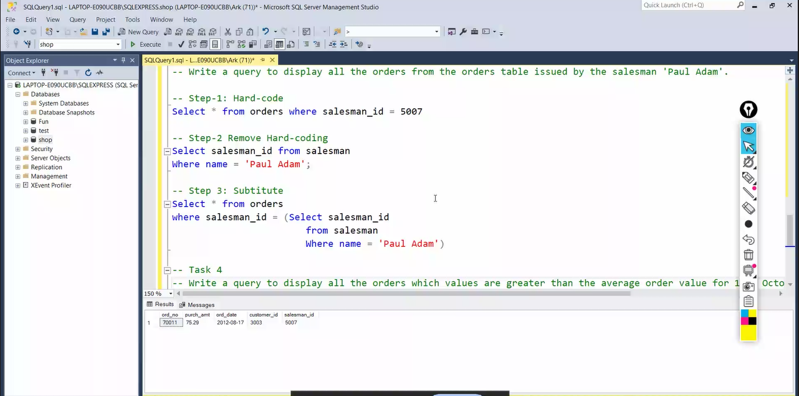
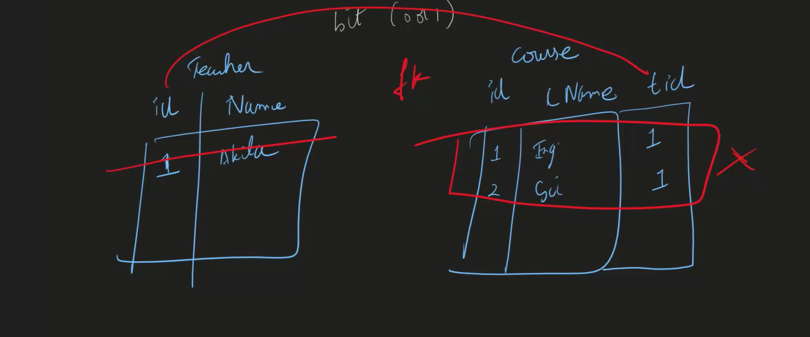

# what is database?
special software to store data.   
 
<b>ram is 10,000 faster than hard-disk.(hdd)</b>  
ram is temporary (fast)   
hdd:permanent.(slow)  
 ssd is min 10 times faster than hdd.  

 ## why database?  
automatically, if we query again and again ,it will store the data in RAM.

bottle neck---which is limiting, (it is not ram). 
    
1. requently asked data, it will store it in ram. so we can access it fast. (creates a copy in a ram)
2. querying become easier. 
3. Crud-easy  
4. backups are inbuilt.  
5. undo-easily(time limit)(keep on undo ing, )
6. performance

can i keep twitter db in a laptop?  
300million people.   
is storage a problem?
No  
it cant handle somany requests, so we dont keep in our laptop.  

 ## where does database live?
   - cloud  .

## what is cloud?   

-- renting pc's   

cloud provider----aws,azure,gcp(google cloud pslatform),ibm cloud,alibaba cloud,salesforce. 
aws--- ahead because they started 1st.  (33% ahead)
netflix is the customer of aws.   

next microsoft azure..... 
its hard to move from one cloud to another. 
because data migration is difficult. 

## best cloud storage providers--  

 
 - they are part of cloud.  
 google drive  
 pcloud 
 dropbox      

##  if ur buying: 
 - initial cost is more or high  
 - rent room 
 - a/c
 - power bill
 - maintenance  (using 24/7)
 - spares should be there.  
 - generator  
 ## if ur renting:(server is online all the time)
 Disaster management:   
 1. flood,earthquake, occurs choose a place where all these dont happen which is not prone to disaster.
 2. fire occurs, then backup.  
 
 ## how do u rent pc? 
   

1. choosing 
2. installing os-  
   what os in cloud?
    - linux is in cloud
the most used os is linux.  
-  what is the problem with windows:---> we hve to pay license   

# advantage of linux
1. free  
2. open source(linux is used my manyyyyy people like google,amazon etccc so if any bug is found then it can be modified by any developer coz their company system will be crashed .so they will develop / correct the bug.)  
3. secure(everybody fixex bug if any vulneralbility comes)
4. small footprint(pay as u go, lesser storage,less ram---> less money)
5. automation(every thing can be done using cmd, it can done easily )

linux has flavors like fedora,tails;windows has versions
- distros or distribution:we are using alpine(size:256mb)
windows(40gb)  

 # # scaling:
-  increasing the no.of customers.   
scenario: when there is so much load on page:  

-  vertical scaling:increase ram or proccesor(upgrading/replace the proccesor) thus making system powerful.     

- people can add 256gb of ram   
horizontal scaling: keep on adding more pc's.  

    

which ever is cheaper that is used. 

# auto-scaling:

:
it is upscaling and downscaling.   
if the load is 80%, then pc is required. '
40% less, then  pc is removed.

# how DDoS attack work?
attack from multiple computers and fake traffic can be solved by:
 
.png>)

  
if malicious traffic is there , then it is sent to dummy site. (diverting the traffic--.captcha,ip address)

  ## SQL VS NOSQL  
  SQL:  
  It is stored in the form of tables. 
  pl/sql, mysql,postgres sql,amazon rds.

  NOSQL:
  it is stored in the form of documents
  mangoDB,couchDB, Redis(good as caching),cassandra(netflix used it),dyanamo db.    

 ## primary key:
  - unique values.  
  - it  cannot be null.  
  - only one primary key can be there for one table.  

  ## foreign key:  
  - joining two tables  
  - it is an primary key in another table  
   - 

   ## composite key:
   when one column cannot be primary key, then combine two columns. then it will become composite key.  

why we need to join tables?
to get the particular value, we separted and we require joins. 

separated data/tables --->normalized data  
data all together is ---->denormalised data

  # WHY JOINS: 
  1. storage issue. 
  2. update analomies are avoided(half updated and half not updated) or inconsistency.  
  3. 
   

   # NORMALISATION  (to remove redundacy/duplicate data)
   1. to increase the safety of the data.     
   2.  we dont mess up the data

    

## FIRST NORMAL FORM RULES
  
# 1.

     
# 2. 
  
# 3.
 
# 4. 
no commas and writing. tables  

# drawbacks of 1nf  
 
- updation anamoly occurs
- Deletion anomoly
  if we want to delete 4 rows like trev if 2 rows deleted 2 rows not delelted the this anomoly occurs
- insertion anomoly  

   
# 2NF   
 to be in 2nf it shuld be 2nf+1nf
when we want to change intermediate we are changing at one place only so we are increasing the safety  

  lesser u do updates, more safer is the data.  

  # 3NF  (BCNF)
  
    
    

  every attribute should depend on primary key but ---->no dependency on non key attributes.(which are not primary key).  

  here only cell is updated.  

  # JOINS  
  for safety we normalised.  
  to fetch the data we combine th tables.    

   

   

joins are of two types:
 - inner(common tables of a and b)
 -outer
 1.right(common + extra items of b)
 2. left (common + extra items of a)
 3. full(common +extra items of b+extra items of a)

 # inner:
 
 left join:

 
 right join: 

 # a join b p.k=f.k

 full join:
 
    
 wheneevr we want to drill by next level--->group by  

 # DIFF BETWEEN WHERE AND HAVING:
 - we use where before group by and 
 after filtering by group by, then we use having.     

 - where is for particular condition to check and after tht group by is used.  
 - we cant interchange the order.  
 - order matters.   

 wenever we logs in  we use delete.  

 adding a column,deleting a column,renamE a column------ALTER  
  there is so rename a column, drop and do it.

 # <b>dml:</b>(when ever we want to manipulate)
 select
 insert'
 update
 delete. 

 # ddl:
 create 
 add
 rename 
 alter
 drop 
 truncate.(it doesnot modify table)(deleting the rows)
    
  # DATA TYPES:
  INTEGER,  
  BOOLEAN    

  - FLOAT(UPTO 3 DECIMAL POINTS)  
  DOUBLE(upto 6 decimal points),  
  REAL (upto 12 decimal points)(eg for isro people will use it real)  
  CHARACTER(num_chars)----> storing few character,  
  VARCHAR(num_chars), ---->sentence together 
  TEXT-----> storing string.---->paragraphs  
  DATE,DATETIME 
  BLOB: all the images,videos are stored.  

  path of the file we can keep instead of using blob for storing the images,videos. in file system.

  data integrity:correct data.  
  # CONSTRAINTs:  
  why constraints ?:   
  to maintain data integrity.  

 -  primary key:   
 -autro increment -wenevr we mark a column , id it will get auto increment.  
 - unique  - it doesnot allow any duplicate values.
 - not null  
 - check-
 - foreign key- we dont need to have key to join table.  
 if movie is not released, then how could it be in box office, to avoid these problems then foreign key is used.  
 - saving from messing up the data  

<b>why foreigh key is used?</b>
  
 deleting the data:
   
directly teacher table wont gets del 1st, the fk helps to see that 1st it deletes course table, and then teacer tabl. 
it doesnot allow to del the data in teacher table 1st because course table will have fk that is td from the above table.   
' the constraint is applied on tid 1st. 

 it helps for inserting.  

INTEGER :   
3 types :
1. int(-b,2b)
2. smallint(-32k,32k)
3. bigint. (-9* 10^8 ,9* 10^8)  
STRING:   
unicode: specia
1. NVarchar: it takes double double size.()support multiple languages then use n vachar. (all are made of different multiple unicodes. )  
more safer 

2. varchar:  
 nvarchar(max) will give max size.   

 # learnmicrosoft.com---- to get to know all the data ty[pes of ] sql. 

 DATE:  
 data
 datatime 

 DECIMAL:
 - decimal(exact)  
 eg: decimal(10,2)
 1234.5678
 1234.68 
 it will loose performance
 - float(approx) it may store exact round  of values also.  

 BOOLEAN:  
 -   
it stores data as bits either 0 and 1.    

# Functions
aggregate functions: 
1. max,count,min,sum,avg 
string functionss:  

math functions:

formatting(result modifications)

  

