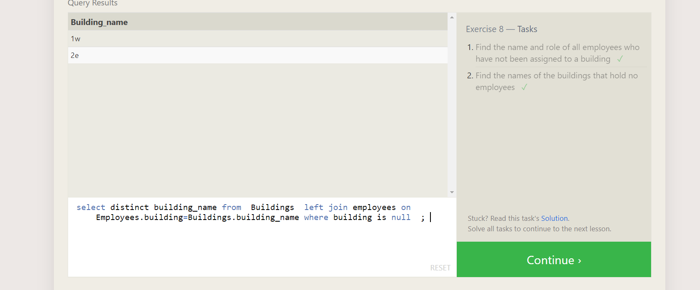
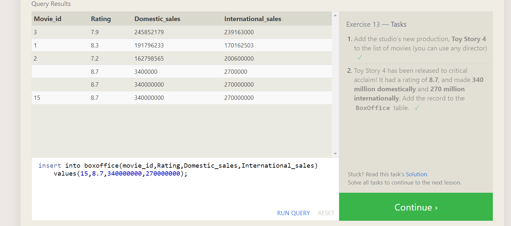
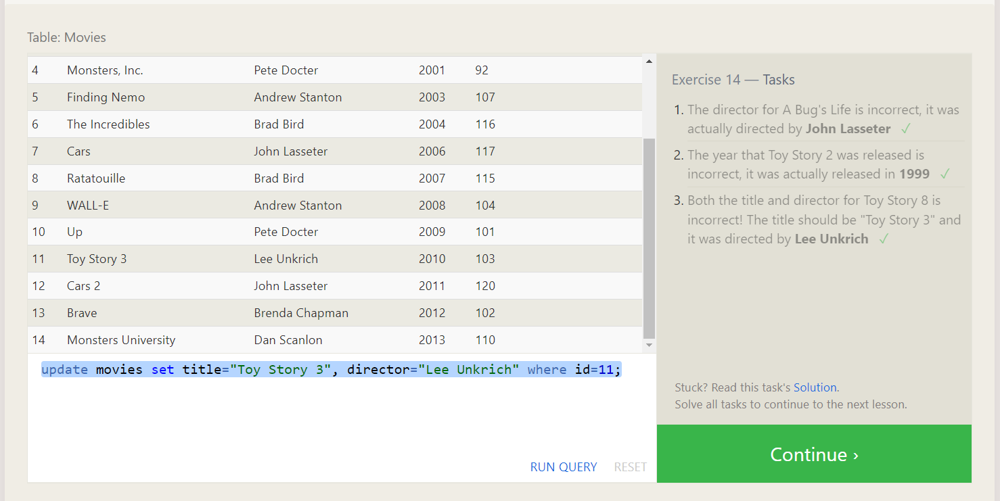
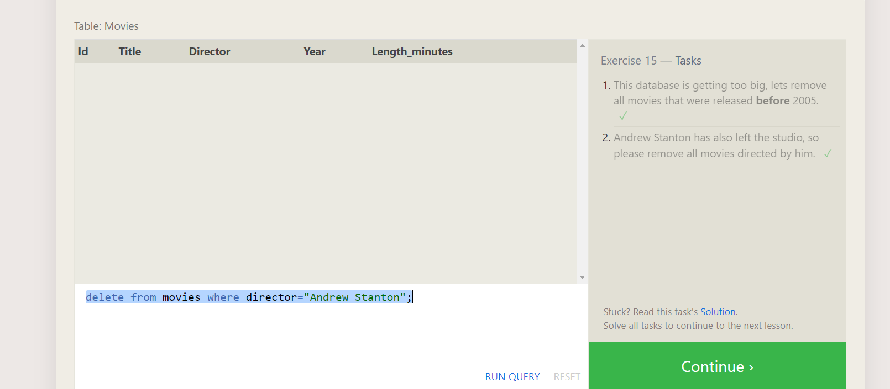
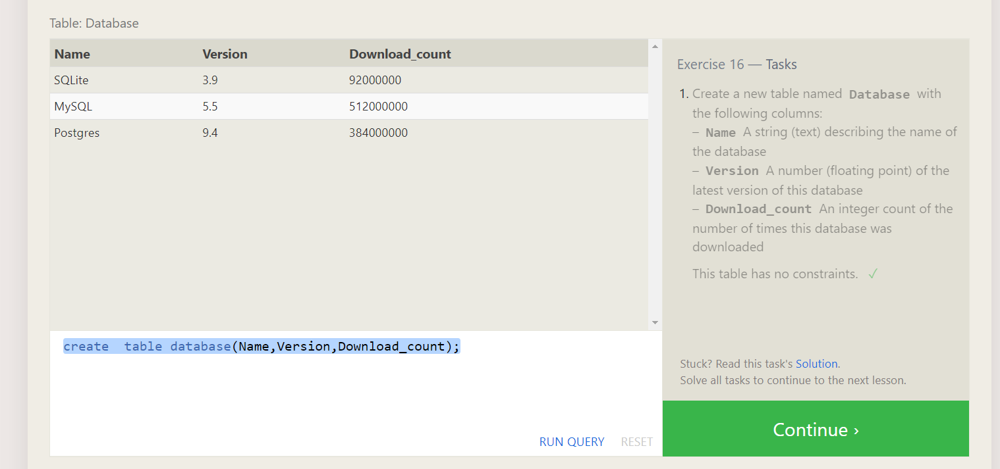

TASK-1
Find the title of each film ✓
```sql
SELECT Title FROM movies;
```
Find the director of each film 
```sql
SELECT director FROM movies;
```
Find the title and director of each film 
```sql
SELECT Title,director FROM movies;
```

Find the title and year of each film
```sql
SELECT  title, year FROM movies;
```

Find all the information about each film
```sql 
SELECT * from Movies;
```
  

## TASK-2:
Find the movie with a row id of 6 ✓
```sql
SELECT title FROM movies where id=6;

```
Find the movies released in the years between 2000 and 2010  
```sql 
select title from movies where year >2000 and year <=2010
```
Find the movies not released in the years between 2000 and 2010  
```sql 
select title from movies where year not between 2000 and 2010
```
Find the first 5 Pixar movies and their release year
```sql

select title,year from movies where id between 1 and 5
```
  

# task 3:
Find all the Toy Story movies
```sql
SELECT title from movies where  title like "%toy story%"
```
Find all the movies directed by John Lasseter 
```sql
select title from movies where director="John Lasseter";
```

Find all the movies (and director) not directed by John Lasseter  

```sql 
select title,director from movies where director not like "John Lasseter";
```
Find all the WALL-* movies
```sql
select title from movies where title like "%wall%"
```
   

# task-4  
List all directors of Pixar movies (alphabetically), without duplicates
```sql
SELECT distinct director from movies order by director asc;
```
List the last four Pixar movies released (ordered from most recent to least)

```sql 
SELECT  title from movies order by year desc limit 4
```
List the first five Pixar movies sorted alphabetically

``` sql 
SELECT  title from movies order by title asc limit 5
```
List the next five Pixar movies sorted alphabetically 
```sql 
SELECT  title from movies order by title asc limit 5 offset 5
```
 

## task-5

List all the Canadian cities and their populations ✓
```sql
select city,population from North_american_cities where country="Canada";

```
Order all the cities in the United States by their latitude from north to south  (latitude dcreases)
```sql
select city from North_american_cities where country="United States" order by latitude desc;
```

List all the cities west of Chicago, ordered from west to east  
```sql
select city from North_american_cities where longitude < select longitude from table where city="Chicago" order by longitude ;
```
List the two largest cities in Mexico (by population) 

```sql

select city from  North_american_cities where country="Mexico" order by population  desc limit 2;
```
List the third and fourth largest cities (by population) in the United States and their population
```sql
select city,population from  North_american_cities where country="United States" order by population desc  limit 2 offset 2;
```  
    

## task-6
Find the domestic and international sales for each movie ✓
```sql
SELECT title,Domestic_sales,International_sales from Boxoffice inner join movies
ON boxoffice.movie_id=movies.id

```
Show the sales numbers for each movie that did better internationally rather than domestically 
```sql
SELECT title,Domestic_sales,International_sales from Boxoffice inner join movies
ON boxoffice.movie_id=movies.id  where boxoffice.International_sales>boxoffice.Domestic_sales 
``` 

List all the movies by their ratings in descending order 


```sql 
SELECT title,Domestic_sales,International_sales from Boxoffice inner join movies
ON boxoffice.movie_id=movies.id   order by Boxoffice.rating desc;
```  
  

## task-7:  
Find the list of all buildings that have employees ✓
```sql 
SELECT distinct  building FROM employees join buildings on Employees.building=Buildings.building_name 
```
Find the list of all buildings and their capacity  
```sql

SELECT  building_name,capacity FROM buildings left join employees on Buildings.building_name=Employees.building 
```
List all buildings and the distinct employee roles in each building (including empty buildings)
```sql  
SELECT distinct building_name,role from  buildings  left join employees on Employees.building=Buildings.building_name ;
```
# task -8
Find the name and role of all employees who have not been assigned to a building ✓
```sql 
SELECT name, role from employees where building is  null;
```
Find the names of the buildings that hold no employees:
```sql 
select distinct building_name from  Buildings  left join employees on Employees.building=Buildings.building_name where building is null  ; 
```



# TASK-9:

List all movies and their combined sales in millions of dollars
```sql 

SELECT title, (Domestic_sales+International_sales)/1000000
as combined_sales from boxoffice 
left join movies
on Boxoffice.Movie_id= Movies.Id;
```
List all movies and their ratings in percent
```sql
\SELECT title,round((rating/10)*100)
as rating from boxoffice 
left join movies
on Boxoffice.Movie_id= Movies.Id;
```
List all movies that were released on even number years
```sql
SELECT title
 from movies 
 where year%2==0;
```
  

# TASK-10  

Find the longest time that an employee has been at the studio ✓  
```sql
SELECT max(years_employed) from employees ; 
```
For each role, find the average number of years employed by employees in that role  

```sql 

select role,avg(Years_employed) from employees group  by role;
```
Find the total number of employee years worked in each building 
```sql 
select building, sum(years_employed) from employees group by building;  
```  
   

 # TASK-11:

 Find the number of Artists in the studio (without a HAVING clause)  
 ```sql 
 select count(role) from employees where role="Artist";

 ```
Find the number of Employees of each role in the studio
```sql 
select role, count(role) from employees group by role ;
```
Find the total number of years employed by all Engineers
```sql 
select sum(Years_employed) from employees  where role="Engineer";

```
  

# task-12
Find the number of movies each director has directed ✓
```sql
SELECT director,count(title) from Movies group by director;

```
Find the total domestic and international sales that can be attributed to each director
```sql 
SELECT director,sum(Domestic_sales+International_sales) from Boxoffice inner join  Movies on  Boxoffice.Movie_id=Movies.Id group by director;
```   


 # task-13
 Add the studio's new production, Toy Story 4 to the list of movies (you can use any director) ✓  
 ```sql 
insert into Movies
(title,director,year,length_minutes)
VALUES("Toy Story 4","aish",1997,90);

 ```
Toy Story 4 has been released to critical acclaim! It had a rating of 8.7, and made 340 million domestically and 270 million internationally. Add the record to the BoxOffice table.  
```sql
insert into boxoffice(movie_id,Rating,Domestic_sales,International_sales) values(15,8.7,340000000,270000000);
```


# task-14  

The director for A Bug's Life is incorrect, it was actually directed by John Lasseter ✓
```sql
update movies set director="John Lasseter" where title="A Bug's Life"; 


```
The year that Toy Story 2 was released is incorrect, it was actually released in 1999

```sql 

update movies set year=1999 where title="Toy story 2";
```
Both the title and director for Toy Story 8 is incorrect! The title should be "Toy Story 3" and it was directed by Lee Unkrich
```sql
update movies set title="Toy Story 3", director="Lee Unkrich" where title="toystory 8";
```  

  

# task-15  

This database is getting too big, lets remove all movies that were released before 2005.  
```sql 
delete from movies where year<2005;

```
Andrew Stanton has also left the studio, so please remove all movies directed by him.
```sql 

delete from movies where director="Andrew Stanton";
```


# task-16:
Create a new table named Database with the following columns:
– Name A string (text) describing the name of the database
– Version A number (floating point) of the latest version of this database
– Download_count An integer count of the number of times this database was downloaded
This table has no constraints. ✓  
```sql
create  table database(Name TEXT,Version FLOAT,Download_count INTEGER);
```


# TASK-17 
adding a column,deleting a column,renamE a column 

Add a column named Aspect_ratio with a FLOAT data type to store the aspect-ratio each movie was released in. ✓

```sql
alter table Movies add  Aspect_ratio FLOAT;

```
Add another column named Language with a TEXT data type to store the language that the movie was released in. Ensure that the default for this language is English.
```sql
alter table Movies add  Language TEXT default English;  

```   

# task-18  

1. We've sadly reached the end of our lessons, lets clean up by removing the Movies table ✓

```sql
drop table if exists  movies;

```

2. And drop the BoxOffice table as well
```sql 
drop table boxoffice;
```  
